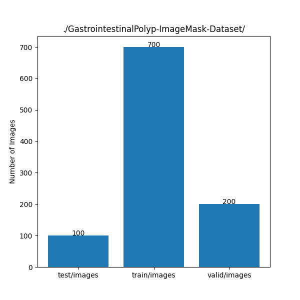
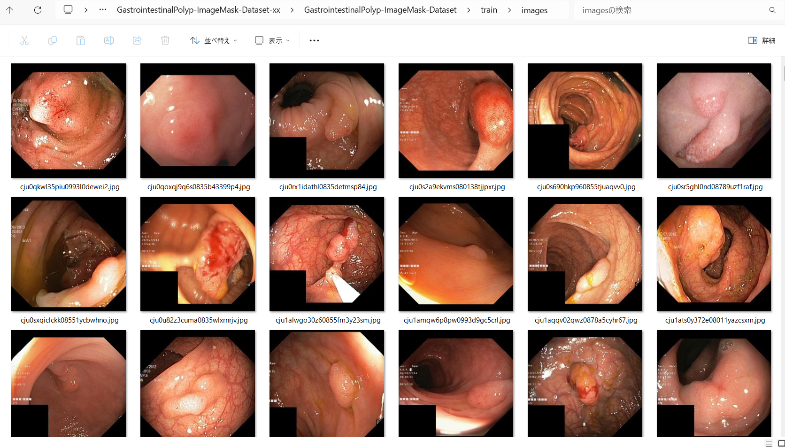
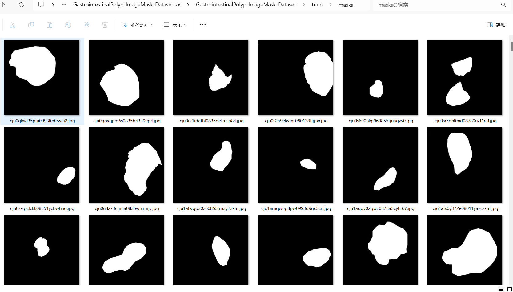
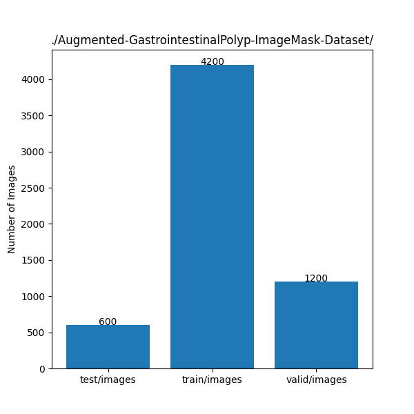

<h2>ImageMask-Dataset-GastrointestinalPolyp (Updated: 2024/03/12)</h2>
This is a GastrointestinalPolyp ImageMask Dataset for Image Segmentation.   
 

<h3>1. Dataset Citatioin</h3>

The image dataset used here has been taken from the following kaggle web site. 
<a href="https://www.kaggle.com/datasets/debeshjha1/kvasirseg">Kvasir-SEG Data (Polyp segmentation & detection)</a>

<b>About Dataset</b>
<pre>
Kvasir-SEG information:
The Kvasir-SEG dataset (size 46.2 MB) contains 1000 polyp images and their corresponding ground truth 
from the Kvasir Dataset v2. The images' resolution in Kvasir-SEG varies from 332x487 to 1920x1072 pixels. 
The images and its corresponding masks are stored in two separate folders with the same filename. 
The image files are encoded using JPEG compression, facilitating online browsing. 
The open-access dataset can be easily downloaded for research and educational purposes.
</pre>

<b>Applications of the Dataset</b> 
<pre>
The Kvasir-SEG dataset is intended to be used for researching and developing new and improved methods 
for segmentation, detection, localization, and classification of polyps. 
Multiple datasets are prerequisites for comparing computer vision-based algorithms, and this dataset 
is useful both as a training dataset or as a validation dataset. These datasets can assist the 
development of state-of-the-art solutions for images captured by colonoscopes from different manufacturers. 
Further research in this field has the potential to help reduce the polyp miss rate and thus improve 
examination quality. The Kvasir-SEG dataset is also suitable for general segmentation and bounding box 
detection research. In this context, the datasets can accompany several other datasets from a wide 
range of fields, both medical and otherwise.
</pre>
<!--
<b>Ground Truth Extraction</b> 
<pre>
We uploaded the entire Kvasir polyp class to Labelbox and created all the segmentations using this application. 
The Labelbox is a tool used for labeling the region of interest (ROI) in image frames, i.e., the polyp regions 
for our case. We manually annotated and labeled all of the 1000 images with the help of medical experts. 
After annotation, we exported the files to generate masks for each annotation. 
The exported JSON file contained all the information about the image and the coordinate points for generating 
the mask. To create a mask, we used ROI coordinates to draw contours on an empty black image and fill the 
contours with white color. The generated masks are a 1-bit color depth images. The pixels depicting polyp tissue, 
the region of interest, are represented by the foreground (white mask), while the background (in black) does not 
contain positive pixels. Some of the original images contain the image of the endoscope position marking probe, 
ScopeGuide TM, Olympus Tokyo Japan, located in one of the bottom corners, seen as a small green box. 
As this information is superfluous for the segmentation task, we have replaced these with black boxes in the 
Kvasir-SEG dataset.
</pre>
-->
See also:
<pre>
Kvasir-SEG
https://paperswithcode.com/dataset/kvasir-seg
</pre>

<h3>
2. Download master dataset
</h3>
Please download the original dataset from the following link
<pre>
Kvasir-SEG Data (Polyp segmentation & detection)
https://www.kaggle.com/datasets/debeshjha1/kvasirseg
</pre>

Kvasir-SEG dataset has the following folder structure. 
<pre>
Kvasir-SEG
├─annotated_images
├─bbox
├─images
└─masks
</pre>

<h3>
3. Create ImageMask Dataset
</h3>

Please move the "./generator" folder, and run Python script <a href="./generator/ImageMaskDatasetGenerator.py">ImageMaskDatasetGenerator.py</a>..
 
<pre>
>python ImageMaskDatasetGenerator.py
</pre>

This command does the following image processings to generate the test, train and valid sub datasets. 
<pre>
1 Split the files in the original <b>images</b> and <b>masks</b> folders to <b>test</b>, <b>train</b> and <b>valid</b> subsets.
2 Create 512x512 square masks files from the mask files in each subset. 
3 Create 512x512 square images files from the image files in each subset.
</pre>

By using the script above, we have finally created the following dataset. 
<pre>
../GastrointestinalPolyp-ImageMask-Dataset
├─test
│  ├─images
│  └─masks
├─train
│  ├─images
│  └─masks
└─valid
    ├─images
    └─masks
</pre>

<b>Dataset Statistics</b> 
 
 
<b>train/images samples:</b> 

 
<b>train/masks samples:</b> 

 
 

You can download the dataset from the google drive 
<a href="https://drive.google.com/file/d/1f9Bwjt2rKstDRgv5zztfrBl-DLZNo--c/view?usp=sharing">
GastrointestinalPolyp-ImageMask-Dataset.zip</a> (2024/03/12)

<h3>
4. Create Augmented ImageMask Dataset
</h3>

If you would like to generate an augmented dataset, please specify the second parameter to be True .
<pre>
>python ImageMaskDatasetGenerator.py True
</pre>

This command does the following image processings to generate the augmented test, train and valid sub datasets. 
<pre>
1 Split the files in the original <b>images</b> and <b>masks</b> folders to <b>test</b>, <b>train</b> and <b>valid</b> subsets.
2 Create 512x512 square flipped, mirrored and rotated masks files from the mask files in each subset. 
3 Create 512x512 square filpped, mirrored and rotated images files from the image files in each subset.
</pre>
<b>Augmented Dataset Statistics</b> 
 
 

You can download the augmented dataset from the google drive 
<a href="https://drive.google.com/file/d/1E8qG7b_jKXAmvy777N5lqzg_fRzY8WjX/view?usp=sharing
Augmented-GastrointestinalPolyp-ImageMask-Dataset.zip</a> (2024/03/12)

 
 
